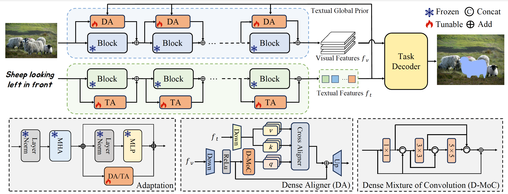

# DETRIS

This is an official PyTorch implementation of [Densely Connected Parameter-Efficient Tuning for Referring Image Segmentation](https://arxiv.org/abs/2501.08580).

# Overall Architecture



# Preparation

## Environment
```bash
conda create -n DETRIS python=3.9.18 -y
conda activate DETRIS
pip install torch==2.0.1 torchvision==0.15.2 torchaudio==2.0.2
pip install -r requirement.txt
```

## Datasets
The detailed instruction is in [prepare_datasets.md](tools/prepare_datasets.md)

## Pretrained weights
Download the pretrained weights of DiNOv2-B, DiNOv2-L and ViT-B to pretrain
```bash
mkdir pretrain && cd pretrain
## DiNOv2-B
wget https://dl.fbaipublicfiles.com/dinov2/dinov2_vitb14/dinov2_vitb14_reg4_pretrain.pth
## DiNOv2-L
wget https://dl.fbaipublicfiles.com/dinov2/dinov2_vitl14/dinov2_vitl14_reg4_pretrain.pth
## ViT-B
wget https://openaipublic.azureedge.net/clip/models/5806e77cd80f8b59890b7e101eabd078d9fb84e6937f9e85e4ecb61988df416f/ViT-B-16.pt
```

# Quick Start

To train DETRIS, modify the script according to your requirements and run it:

```
bash run_scripts/train.sh
```

If you want to use multi-gpu training, simply modify the `gpu` in the run_scripts/train.sh. Please notice that you should execute this bash script under the first-level directory (the path with train.py).

To evaluate DETRIS, specify the model file path in test.sh according to your requirements and run the script:

```
bash run_scripts/test.sh
```

If you want to visualize the results, simply modify the `visualize` to `True` in the config file. 

## Results
| Method                       | RefCOCO (val) | RefCOCO (testA) | RefCOCO (testB) | RefCOCO+ (val) | RefCOCO+ (testA) | RefCOCO+ (testB) | G-Ref (val(u)) | G-Ref (test(u)) | G-Ref (val(g)) | Avg   |
|------------------------------|---------------|------------------|-----------------|----------------|-------------------|------------------|----------------|------------------|----------------|-------|
| DETRIS-B (Ours)             | 76.0          | 78.2            | 73.5           | 68.9           | 74.0             | 61.5            | 67.9          | 68.1            | 65.9           | 70.4  |
| DETRIS-L (Ours)             | 77.3      | 79.0        | 75.2       | 70.8       | 75.3         | 64.7        | 69.3      | 70.2        | 67.9       | 72.2 |
| DETRIS-L* (Ours)            | 81.0      | 81.9            | 79.0       | 75.2       | 78.6         | 70.2        | 74.6      | 75.3        | -              | 77.2 |

\* denotes tuned using the mixed RefCOCO/RefCOCO+/G-Ref datasets

## Weights

Our model weights have already been open-sourced and can be directly downloaded from [Huggingface](https://huggingface.co/x6team/DETRIS/tree/main).

# Acknowledgements

The code is based on [CRIS](https://github.com/DerrickWang005/CRIS.pytorch), [ETRIS](https://github.com/kkakkkka/ETRIS) and [DiNOv2](https://github.com/facebookresearch/dinov2). We thank the authors for their open-sourced code and encourage users to cite their works when applicable.

# Citation

If DETRIS is useful for your research, please consider citing:

```angular2html
@article{huang2025densely,
  title={Densely Connected Parameter-Efficient Tuning for Referring Image Segmentation},
  author={Huang, Jiaqi and Xu, Zunnan and Liu, Ting and Liu, Yong and Han, Haonan and Yuan, Kehong and Li, Xiu},
  journal={arXiv preprint arXiv:2501.08580},
  year={2025}
}
```

